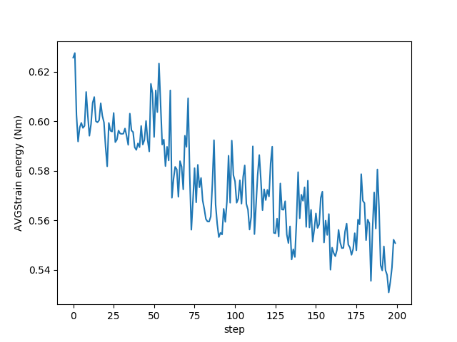
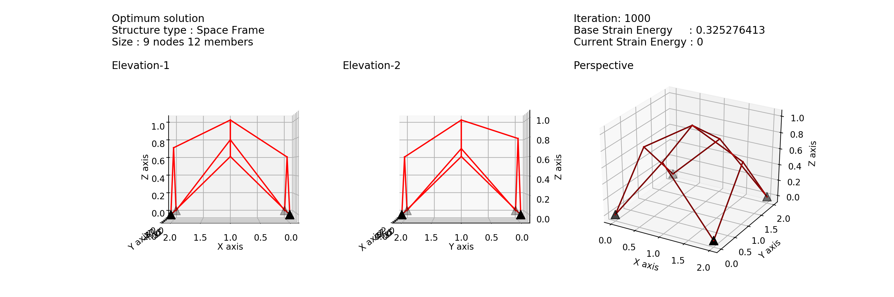

# Frame_GA
Frame optimization using Genetic Algorithm in python

This is the frame geometry optimization program using Genetic Algorithm(GA).
There are many types of GA. The type of GA in this program is developed from professor Yamamoto Kenji and Minakawa Youichi's GA.
The program optimize the strain energy of the frame structure by adjusting nodal heights.

The repository includes 4 files
1. FEM_frame.py : 3D Frame structural analysis file
2. frame_GEN.py : Frame structure generate file
3. frame_GA.py : Genetic Algorithm file
4. master_frame_GA.py : Main file

The master_frame_GA.py will create 3 outputs
1. A graph of average strain energy in each iteration
2. A graph of minimum strain energy in each iteration
3. Images of the strcutre

Example
A graph of average strain energy in each iteration
 

 
An image of the strcutre
 

 
Please feel free to contact me at kupc25648@hotmail.com

